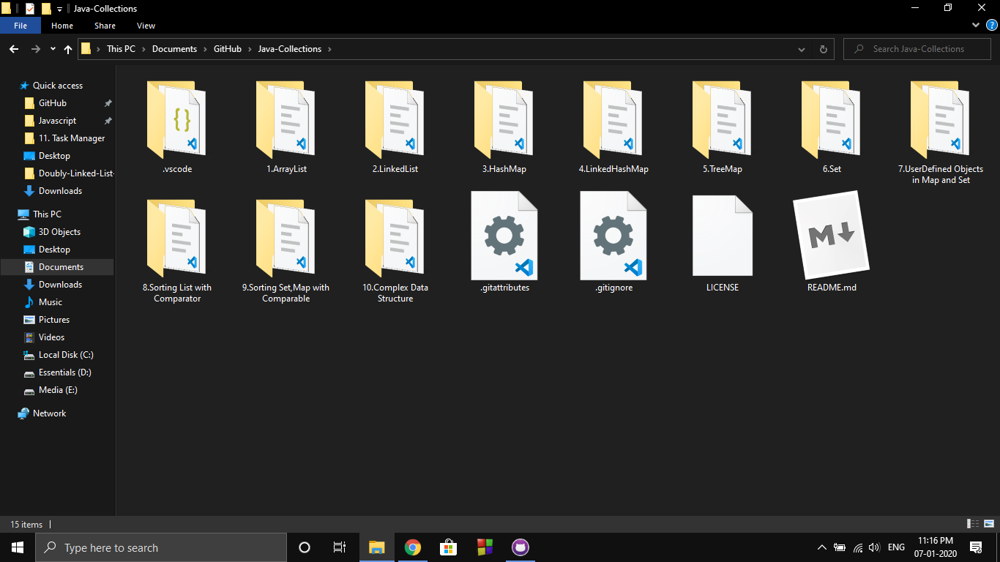

# Java Collections

This repository is created with the sole purpose of learning the Java Collections Framework. I had brief theoretical knowledge about the Collection Framework. Therefore, I wanted to implement that on practice.

## Content

## Objectives

1. Distinguishing List , Set and Map
2. Understanding basics of the above data structures
3. Implementing LinkedHashSet and LinkedHashMap
4. Creating complex data structure
5. Using user defined objects in Set and Map
6. Using comparator interface for List
7. Using comparable interface for Set and Map
8. Overriding the equals() and hashCode() method

## Developer

LinkedIn : [iamsomraj](https://www.linkedin.com/in/iamsomraj/) 😊

HackerRank: [iamsomraj](https://www.hackerrank.com/iamsomraj?hr_r=1) 😊

## Show Your Support

Give me a star ⭐

if this project helped you 👦 👧

## Contributing

Pull requests are welcome. 🤝 For major changes, please open an issue first to discuss what you would like to change. 🙏

Please make sure to update tests as appropriate. ✌

## License

[MIT](https://choosealicense.com/licenses/mit/) 📰